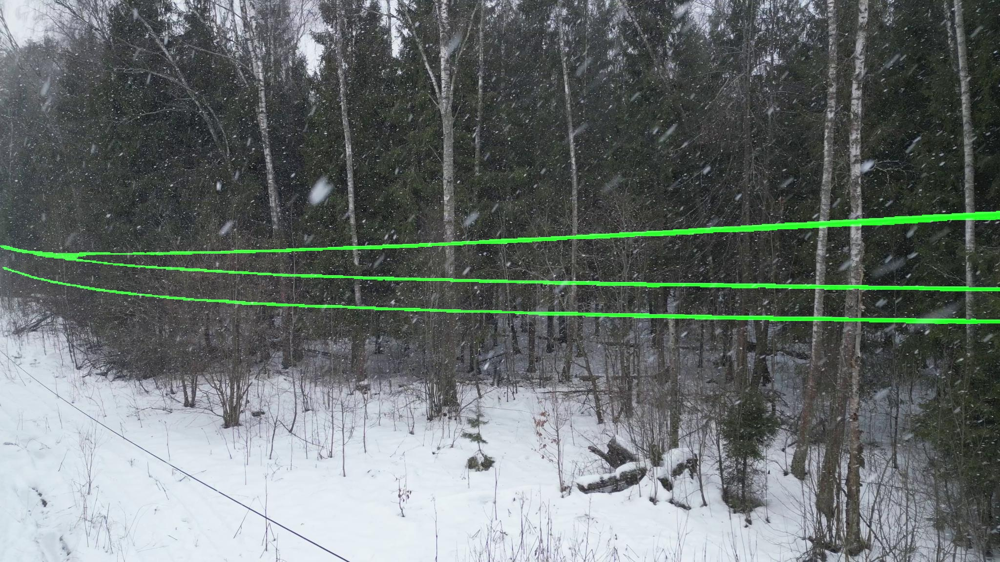

RGS-UNet (ResNet18-Ghost Module-SIMAM-UNet)
================================
Модель для скоростной и точной сегментации проводов на edge-устройстве (например линейки Jetson Orin)

Разработана на основе статьи опубликованной 04.06.2025: https://www.mdpi.com/1424-8220/25/11/3551

Сборка в Google Colab: https://colab.research.google.com/drive/1ZRCXQ8MNQfr3GllVqcs6X81Otx8x-DRW?usp=sharing

## Примеры разметки
<p align="center">
  
  
</p>
<p align="center">
  
  
</p>
<p align="center">
  
  
</p>
<p align="center">
  
  
  <br>
  <em>Слева — исходное изображение, справа — маска сегментации</em>
  <br>
  <em>Разметка выполнялась для трёх силовых кабелей, без телефонных линий натянутых ниже</em>
</p>

Структура проекта
------------------------------
- `train.py` / `infer.py` — скрипты обучения и инференса
- `nn_architecture.py` — архитектура сети
- `nn_utils.py` — метрики/лоссы и утилиты
- `data_generator.py` - генератор данных для нейросети
- `config.py` — конфиг путей и гиперпараметров
- `requirements.txt` — зависимости
- `assests/` — папка для примеров работы модели

**Вход:** RGB 736x1280 (по умолчанию; настраивается через DIMENSIONS в config)  
**Выход:** 1-канальная карта вероятностей (маска семантической сегментации)

Доступна опция **mixed precision** для работы в float16 и сохранением хрупких мест в float32 через флаг MIXED_PRECISION в config

## Особенности архитектуры:
- Кастомные слои GhostModule вместо обычной свёртки, модифицированная ResNet18 в качестве backbone и ряд других изменений обеспечивают снижение числа избыточных параметров модели до 57% от исходной UNet архитектуры, что даёт существенный
пророст производительности.
- За счёт элементов SIMAM attention и замены активационной функции на Mish обеспечивается прирост точности, превышающий базовую UNet
- Комплексная функция ошибки, включающая в себя DICE для более плавной сходимости, Focal loss для более точного определения границ проводов, Tversky для борьбы с разрывами масок при распознавании

<p align="center">
  
  <br>
  <em>Архитектура сети RGS-UNet</em>
</p>

<p align="center">
  
  <br>
  <em>Сравнительные кривые метрик для конкурирующих моделей: (a) сравнительные кривые для F1-Scores; (b) сравнительные кривые для IoU.</em>
</p>

Установка проекта и среды
------------------------------
```bash
# Клонирование репозитория
git clone https://github.com/NakamuraShio/RGS-UNet.git
cd RGS-UNet

# Создание виртуального окружения
python -m venv venv

# Активация (выберите вариант для своей ОС)
# Windows:
venv\Scripts\activate
# macOS / Linux:
source venv/bin/activate

# Установка зависимостей
pip install -r requirements.txt
```

Запуск в режиме инференса
------------------------------
Возможен запуск в трёх режимах обработки:
- обработка изображения,
- обработка видео,
- пакетная обработка папки с изображениями и видео целиком

**Доступ через import:**
```python
# input_path - путь к изображению, видео файлу или папке с файлами
# save_path - путь, куда сохранять результат обработки (изображение или видео с нанесённой маской)

from infer import run_segmentation
run_segmentation(input_path, save_path)
```

**Доступ через терминал:**
```python
# Обработка одного изображения
python -m RGS-UNet.infer --input "./materials/frame.jpg" --output "./results/"
# Обработка одного видео файла
python -m RGS-UNet.infer --input "./materials/video.mp4" --output "./results/"
# Обработка всех файлов в папке
python -m RGS-UNet.infer --input "./materials" --output "./results/"
```

Обучение модели
------------------------------
```python
# Пример запуска через import
from train import train_model
history = train_model(dataset_path, weights_path)

# Пример запуска через терминал
python -m RGS-UNet.train --dataset "./dataset" --weights "./RGS-UNet/weights"
```


Автор проекта
------------------------------
**Артём Алмазов**  
Computer Vision Developer

Email: aaalmaz@gmail.com  
[LinkedIn](https://www.linkedin.com/in/artem-almazov/)